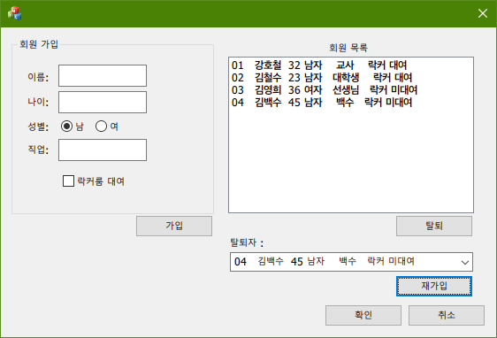

# Basic Register Program with MFC Programming
[2020-10-16] Basic Register Program with MFC Programming (C++)

### 프로그램 개발 환경
- Language : C++
- OS : Microsoft Windows 10
- IDE : Microsoft Visual Studio 2019 16.4

### 기능 설명
- Basic Control을 이용하여 만든 프로그램.
- 회원 가입, 회원 탈퇴, 탈퇴 회원 재가입 기능 구현

### 실행 화면

